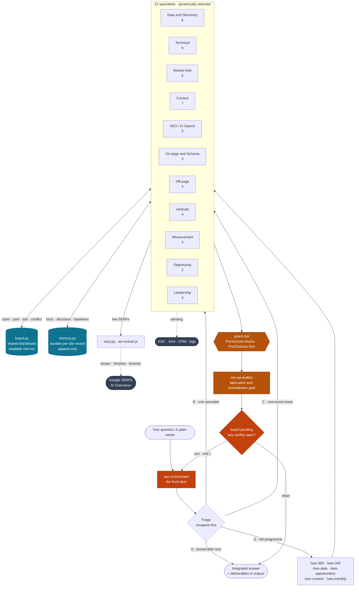
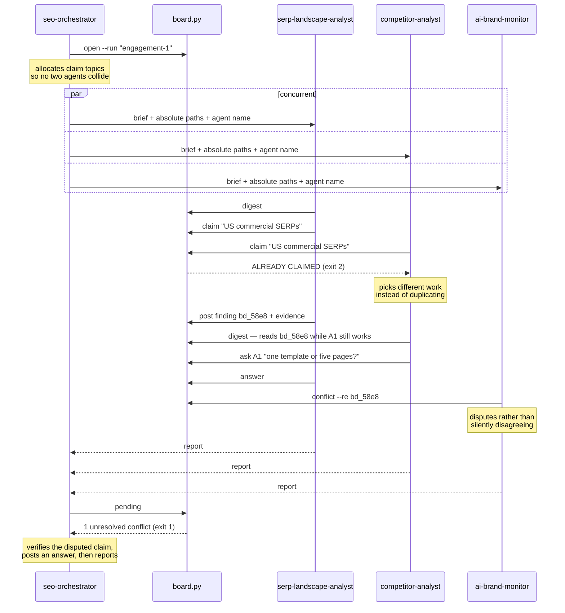

# SEO + AEO Agent Team

A 52-agent search department. Fill in two files, run one command, and the whole
team works your site — classic SEO and Answer Engine Optimization, from crawl
forensics through content production to forecasting.

## Setup

```bash
git clone https://github.com/Rytsense-Technologies/SEO-agents.git
cd SEO-agents
cp .env.example .env          # add a SERP API key for live Google results
node evals/run.mjs static     # verify all 52 agents load correctly
```

1. Fill in **`input/site-profile.md`** — who you are, what you sell, who you
   compete with, what you want. Leave unknowns as `TBD`.
2. Fill in **`input/data-access.md`** — what the team can actually see. This
   decides which agents run at full strength and which degrade honestly.
3. Open the folder in Claude Code and run a command.

**Two runtimes, split by role.** The data tools are Python because that is what
an SEO team reads and extends; the enforcement hook is Node because it runs on
every tool call and must work with zero setup.

| Layer | Runtime | Why |
|---|---|---|
| `serp.py` · `board.py` · `memory.py` | Python 3.9+ | Team-facing. `board`/`memory` are stdlib-only; `serp` needs `requests`. |
| `guard.mjs` | Node 18+ | A `PreToolUse` hook. Claude Code runs on Node, so it is guaranteed present — a hook that silently fails to run is worse than no hook. |
| `apply-protocol.mjs` · `evals/run.mjs` | Node 18+ | Repo maintenance and CI. Zero deps. |
| `aio-extract.js` | Browser JS | Injected into the page; it has to be JavaScript. |

```bash
pip install -r requirements.txt              # one dependency: requests
pip install -e ".[dev]" && pytest            # tests, lint, format
```

Twenty tests cover the behaviours that carry consequence rather than chasing a
coverage number — the honesty guarantees (an unseeable SERP feature must
normalize to `None`, never `0`), the coordination mechanics (a conflict gates the
wave at exit 1; answering the disputed *finding* does not clear it), and two
regressions for bugs found in this codebase. `pyproject.toml` carries the ruff,
black, isort and coverage config.

### Installing globally

`install.sh` (or `install.ps1` on Windows) copies the agents and commands into
`~/.claude/` so the team is available in every project:

```bash
./install.sh            # agents + commands
./install.sh --check    # show what would change, write nothing
./install.sh --uninstall
```

The tools, memory, and evals stay in this repo — agents reference them by
relative path, so run engagements from a clone rather than from an arbitrary
directory.

## Live Google SERP access

Real competitive analysis needs real results pages: actual positions, AI
Overview sources, featured snippet holders, ad load. `tools/serp.py` provides
that through a SERP API, normalized into one shape so agents never branch on
provider.

```bash
python tools/serp.py providers                         # what is configured
python tools/serp.py search "best crm for agencies"
python tools/serp.py batch keywords.txt --out output/data/serp/
python tools/serp.py compare --domain you.com --vs a.com,b.com --keywords kw.txt
python tools/serp.py aeo-check queries.txt --provider serpapi
```

`compare` is the competitive workhorse — it returns your position against each
named competitor across a keyword set, whether an AI Overview is present, who it
cites, who holds the snippet, and an estimated click availability per SERP.

Pick one provider and put the key in `.env`:

| Provider | Free tier | Then | AI Overview | Ad load |
|---|---|---|---|---|
| [serper.dev](https://serper.dev) | 2,500 queries | ~$0.30/1k | No | No |
| [serpapi.com](https://serpapi.com) | 100/month | ~$50/5k | **Yes** | Yes |
| [valueserp.com](https://valueserp.com) | 100/month | ~$25/5k | Yes | No |

**Provider capability honesty.** Providers differ in what they can see, and a
provider that never reports AI Overviews would make every SERP look
AI-Overview-free — quietly corrupting the AEO track. So the tool declares each
provider's blind spots and reports them as `not checked`, never as absent:

```
$ python tools/serp.py providers
Active: serper
  Detects:      organic, peopleAlsoAsk, relatedSearches, knowledgeGraph, localPack, featuredSnippet
  NOT detected: aiOverview, topAds, bottomAds, shopping, videos, images
  These are reported as "not checked", never as absent.
```

Reports carry the caveat inline, and the click-availability estimate warns that
it is understated when ad load is invisible. Setting several keys is fine —
`SERP_PROVIDER` chooses. A sensible setup is serper for bulk ranking work plus
serpapi for AI Overview spot-checks.

**Why an API rather than scraping Google directly:** scraping google.com breaches
Google's ToS, hits CAPTCHAs within a handful of queries, and returns personalized
or degraded results that make the analysis wrong. These APIs exist for this
purpose and run at consistent locations. With no key configured the tool says so
and agents fall back to the `WebSearch` tool, labelling the reduced fidelity in
their output rather than pretending otherwise.

`aeo-check` reports AI Overview presence and, crucially, **which domains get
cited**. It refuses to run on a provider that cannot see AI Overviews rather
than returning a comfortable zero. `--provider` overrides per call, so serper
can do bulk ranking work while serpapi handles AEO spot-checks; the cache is
keyed by provider so the two never collide.

Responses cache for 24h (`SERP_CACHE_TTL_HOURS`) so re-running a wave costs
nothing extra.

### Getting AI Overview data specifically

Verified against serper on 2026-09-17: three queries that reliably trigger AI
Overviews (`what is a crm system`, `how does dns work`, `benefits of
intermittent fasting`) returned **no AI-related fields at all**. Four routes:

1. **SerpApi** — the only one of the three returning `ai_overview` with its
   `references`. 100 free calls/month covers a 20-40 query tracking set.
2. **Ask the engines directly** — this is the bigger point. `ai-brand-monitor`
   measures citation by *querying* ChatGPT, Perplexity, Claude and Gemini with
   the prompt set, not by reading a Google SERP. Google's AI Overview is one
   surface of four, and the other three never needed a SERP API.
3. **The GSC fingerprint** — `gsc-data-analyst` already flags query segments
   where impressions hold steady while clicks fall, which is the signature of
   AI Overview absorption. Indirect, but it comes free from data you have.
4. **Read them in the browser — free, and it works.** `/aeo-verify` drives the
   built-in browser pane and runs `tools/aio-extract.js` against the rendered
   SERP. Verified live on 2026-09-17: it pulled the overview text plus seven
   cited publishers (Salesforce, Microsoft, HubSpot, Oracle, Excelsior,
   Microsoft Dynamics 365, KWIGA.com) from a single query.

   Google obfuscates AI Overview citation links as `/goto?url=CAES…` redirects,
   so destinations cannot be read from the href. The publisher names survive in
   `aria-label` as `"<Title> - <Publisher>. Opens in new tab."`, which is the
   extraction point. You get brands, not domains.

   This is bounded on purpose: automated querying of Google Search is against
   their ToS, so the workflow is capped at a ~20-40 query tracking set with
   pauses between queries, and it **stops at any bot check rather than working
   around it**. For bulk, pay for an API.

## Finding new business, not just new rankings

Most SEO tooling answers "how do we win the demand we already serve". The
opportunity pair answers the opposite question: **what demand are we turning
away?**

`opportunity-finder` mines twelve signal sources — GSC impressions for things
you do not sell, GA4 internal searches that returned nothing, weak SERPs where
nobody has productized the answer, competitor complaint mining on G2 and Reddit,
unbundling language, segment modifiers at volume, price-ladder gaps, DIY demand,
tool-shaped queries, rising terminology, and geographic gaps. Convergence across
two or three independent sources is the strongest evidence available.

`opportunity-validator` then tries to kill each one: it re-opens every citation
rather than trusting the finder, then runs seven tests — evidence, demand
durability, willingness to pay, whitespace reality (is it unserved, or unserved
*for a reason*), capability honesty, cannibalization, and downside. Verdicts are
PURSUE, TEST FIRST (with a pre-agreed kill threshold), PARK, or KILL.

They are split deliberately. One agent cannot both generate enthusiastically and
judge honestly — search data makes almost anything look like a market if you
squint, and an unkilled bad opportunity costs quarters rather than an article.

```bash
/seo-opportunities        # quarterly, not monthly — signals need time to accumulate
```

## Guardrails

Prose guardrails in an agent file are instructions a model can drift from.
These are mechanical — `tools/guard.mjs` runs as a Claude Code hook, wired in
`.claude/settings.json`.

**`PreToolUse` — blocks before execution:**
- Destructive shell: `rm -rf /`, `git reset --hard`, `git clean -f`, force push,
  piping a remote script into a shell, `DROP TABLE`
- Live mutations: deploying, publishing to a CMS, pushing commits. The team
  drafts; humans ship.
- Secrets in commands or file writes (OpenAI, Anthropic, GitHub, AWS, Google
  keys, private keys)
- Writes to `.env`, git internals, or credential files

**`PostToolUse` — lints every deliverable written to `output/`:**
- Unsourced quantitative claims — search volumes, authority scores, percentage
  lifts, ranking positions, link counts — unless the surrounding text cites a
  source or labels the figure an estimate
- Prohibited tactics recommended rather than refused

The fabrication linter warns rather than blocks, deliberately: a false block on
genuine GSC data would be worse than a false warning. Run it manually any time:

```bash
node tools/guard.mjs lint output/*.md
node tools/guard.mjs selftest
```

## Memory

SEO is measured in quarters. Without memory every run re-derives the same
conclusions, re-litigates settled decisions, and cannot tell whether last
month's work did anything. `tools/memory.py` gives each domain five stores:

| Store | Discipline | Holds |
|---|---|---|
| `facts` | upsert | Verified durable truths — stack, market, constraints |
| `decisions` | append-only | Choices, rationale, who decided, what was ruled out |
| `baselines` | append-only | Metric snapshots with source and date |
| `changes` | append-only | What shipped, when, by which agent |
| `learnings` | append-only | What worked, what failed, and why |

Append-only is deliberate: an agent that can rewrite history can quietly erase a
prediction that turned out wrong.

```bash
python tools/memory.py init example.com
python tools/memory.py digest example.com      # the block agents read on start
python tools/memory.py trend example.com --metric organic_clicks
```

Every agent reads the digest before starting and writes back on finish — that
instruction lives in the shared protocol block, applied to all 52 agents by
`tools/apply-protocol.mjs`. Edit the protocol once there and re-run to update
the whole team.

## Evals

```bash
node evals/run.mjs static      # validate all 52 definitions — milliseconds, CI-safe
node evals/run.mjs fixture     # score output against 16 planted defects
node evals/run.mjs score <f>   # rubric-score one deliverable
```

**Static** is the one that catches real regressions: missing frontmatter, an
agent name that no longer matches its filename, a read-only auditor granted
`Edit`, a data agent whose anti-fabrication language was edited away, a broken
cross-reference between agents, a missing `## Output` section. It found three
genuine gaps in this repo's own agents on first run, and later caught 26 agents
that were told to run shell tools without a Bash grant.

**Fixture** runs the team against `evals/fixtures/site/` — a static site with 16
deliberately planted defects including AI crawlers blocked in robots.txt, a
client-rendered homepage with no server HTML, `noindex` on the pricing page, a
canonical pointing at the wrong URL, and an orphan page. It scores recall,
weights critical defects, and **fails automatically on any fabricated figure** —
the fixture has no data sources, so every number in a report about it is
necessarily invented.

`/seo-eval` runs the whole sequence and reports which agent should have caught
each miss. Scoring rubric in [`evals/rubric.md`](evals/rubric.md).

## Commands

| Command | What it runs | When |
|---|---|---|
| `/seo-360` | The full team, 10 waves, ~30 deliverables | New engagement |
| `/seo-quick example.com` | Recon + technical + AEO | Fast triage |
| `/seo-data` | The data department only | Establish facts first |
| `/aeo-360` | The AEO department only | "Why don't AI tools mention us?" |
| `/seo-content 5` | Brief → draft → extractability → edit → schema | Production |
| `/seo-monthly` | Data refresh, citation monitoring, decay, reporting | Every month |
| `/seo-opportunities` | Mine data for new service/product opportunities | Quarterly |
| `/aeo-verify` | Read AI Overviews in the browser, record cited publishers | Monthly |

Or skip the commands entirely and ask `seo-orchestrator` in plain words.
| `/seo-eval` | Static validation + fixture run + scoring | After editing agents |
| `/seo-publish` | Push engagement JSON → Growth Board `#agents` + Activity | End of every programme wave |

Any agent also runs alone: *"use the rendering-specialist agent on example.com"*.

## Architecture



**The load-bearing parts.** Triage runs cheapest-first, so the most common good
outcome is no agent running at all — the answer is already in `output/`. The
board is what lets concurrently running agents coordinate at all, since siblings
cannot message each other. The two gates are not advisory: `guard.mjs` blocks
tool calls before they execute, and an open conflict on the board returns exit 1,
which sends the wave back to the orchestrator instead of shipping a disputed
finding.

### A coordinated wave



The refused claim and the raised conflict are the two moments that justify the
board. Without it, A2 duplicates A1's work and discovers it at integration time,
and A3's disagreement never reaches anyone — which is exactly what happened in
the first live engagement, where two agents reached different conclusions about
the same page and the contradiction surfaced only by chance.


## One entry point

`seo-orchestrator` is the front door. Ask in your own words; it decides what
needs to happen.

It triages into four classes, cheapest first — **answerable now** from existing
output or a quick live check, **single specialist**, **concurrent wave**, or a
**full programme** that should run as a named command with its cost stated up
front. The most valuable thing it does is often not running an agent: re-running
a specialist to reproduce a report already sitting in `output/` is the easiest
way to waste money on a system this size.

Before reporting anything it spot-checks cheap claims. A specialist in the first
live engagement reported a stale title tag that did not reproduce on the page;
relaying it unchecked would have sent the client after a bug that did not exist.

## How agents coordinate

Sibling subagents cannot message each other — they run concurrently, in isolated
contexts, and only the parent sees their output. So they coordinate through a
shared blackboard: `tools/board.py`, run-scoped, append-only, and readable
**mid-run**, so agent B can act on what agent A posted while A is still working.

```bash
python tools/board.py open <domain> --run "<slug>" --goal "<question>"
python tools/board.py digest <domain>     # what every agent reads on startup
python tools/board.py pending <domain>    # exits 1 while anything is unresolved
```

Six entry types — `finding` (with evidence), `question` (routed to an agent),
`answer`, `claim`, `conflict`, `handoff`. Two of them do the real work:

**`claim` refuses duplicate work at the point of starting**, not at integration
time:

```
serp-landscape-analyst  → claimed "US commercial SERPs"
competitor-analyst      → ALREADY CLAIMED by serp-landscape-analyst  (exit 2)
```

**`conflict` surfaces disagreement mechanically.** An agent disputes a specific
finding by id, and `pending` exits 1 until it is adjudicated, so a wave can gate
on it. This exists because two agents in the first engagement reached different
conclusions about the same page and nothing surfaced it — the contradiction was
caught by luck. The orchestrator now adjudicates every conflict before
reporting, on the rule that *a finding two specialists disagree about is not a
finding yet.*

The board is append-only on purpose: an agent that can edit it can quietly
delete the finding that contradicts it. `memory.py` remains the durable record
across engagements; the board is the working surface within one.

## The department

### Orchestration (1)
| Agent | Owns |
|---|---|
| `seo-orchestrator` | Triage, routing, board setup, conflict adjudication, collection |

### Leadership (3)
| Agent | Owns |
|---|---|
| `seo-director` | Strategy, conflict resolution, roadmap, the kill list |
| `seo-project-manager` | Sprints, dev tickets, capacity, risk register |
| `seo-qa-auditor` | Fabrication and contradiction gate. Can BLOCK. |

### Data & discovery (6)
| Agent | Owns |
|---|---|
| `seo-recon` | Crawl, page inventory, stack detection, URL-to-source map |
| `gsc-data-analyst` | 10 deep GSC analyses — striking distance, decay, CTR gaps |
| `ga4-data-analyst` | Revenue per page, AI referral segmentation, page-value matrix |
| `log-file-analyst` | Crawl budget, real bot behavior, AI crawler reality check |
| `index-coverage-analyst` | Indexation forensics, exclusion classes, index bloat |
| `serp-landscape-analyst` | SERP composition, click availability, format mandates |

### Technical (8)
| Agent | Owns |
|---|---|
| `technical-seo-engineer` | Crawl, index, canonicals, redirects — the generalist |
| `crawler-access-engineer` | robots.txt, WAF/CDN bot rules, per-bot policy matrix |
| `rendering-specialist` | What each bot class actually sees; JS/hydration failures |
| `site-architecture-specialist` | Click depth, hierarchy, facets, authority flow |
| `core-web-vitals-engineer` | LCP, INP, CLS diagnosed to cause per template |
| `mobile-seo-specialist` | Mobile-first parity, usability, interstitials |
| `international-seo-specialist` | hreflang, geo-targeting, localization depth |
| `site-migration-specialist` | Redirect maps, launch runbooks, rollback criteria |

### Market intelligence (5)
| Agent | Owns |
|---|---|
| `keyword-strategist` | Clusters, keyword-to-URL map, cannibalization |
| `search-intent-analyst` | 8-way intent classification, satisfaction criteria |
| `competitor-analyst` | Per-SERP wedge analysis — why you can win each one |
| `topical-authority-strategist` | Semantic maps, coverage scores, what to abandon |
| `brand-serp-specialist` | Your own branded results page and its occupants |

### Content (7)
| Agent | Owns |
|---|---|
| `content-architect` | Topical map, inventory decisions, calendar, briefs |
| `content-writer` | Drafts from briefs |
| `content-editor` | Fact-check, cut filler, brief compliance. Can REWRITE. |
| `content-refresh-specialist` | Decay diagnosis and refresh briefs |
| `content-pruning-specialist` | Prune, merge, redirect — with safety rules |
| `eeat-specialist` | Experience, Expertise, Authority, Trust; YMYL handling |
| `conversion-copywriter` | Money pages that rank *and* convert |

### AEO / AI search (5)
| Agent | Owns |
|---|---|
| `aeo-strategist` | The AEO strategy and scorecard |
| `answer-extractability-engineer` | Chunk-testing, answer blocks, snippet capture |
| `entity-grounding-specialist` | Knowledge graph, `sameAs`, disambiguation |
| `conversational-query-researcher` | The prompt space — how people ask chatbots |
| `ai-brand-monitor` | Citation rate, share of voice, factual accuracy |

### On-page & structured data (3)
| Agent | Owns |
|---|---|
| `onpage-optimizer` | Titles, metas, headings, alt text |
| `internal-linking-engineer` | The link graph, cluster topology, anchor rules |
| `schema-engineer` | Connected JSON-LD `@graph`, rich results |

### Off-page (4)
| Agent | Owns |
|---|---|
| `authority-builder` | Linkable assets, outreach, off-site AEO presence |
| `backlink-auditor` | Profile quality, toxic patterns, link reclamation |
| `digital-pr-specialist` | Story angles, named targets, campaign calendar |
| `local-seo-specialist` | GBP, NAP, citations, reviews, local pages |

### Vertical specialists (4, conditional)
| Agent | Activates when |
|---|---|
| `ecommerce-seo-specialist` | Ecommerce or marketplace |
| `programmatic-seo-engineer` | Structured dataset with real query demand |
| `video-seo-specialist` | Video exists, or video-dominant SERPs |
| `image-seo-specialist` | Visual/product business, or image search traffic |

### Opportunity discovery (2)
| Agent | Owns |
|---|---|
| `opportunity-finder` | Twelve signal sources mined for unserved demand — new services, products, segments |
| `opportunity-validator` | Seven adversarial tests; verdicts of PURSUE / TEST FIRST / PARK / KILL |

### Measurement (4)
| Agent | Owns |
|---|---|
| `seo-analyst` | KPI framework, AI-visibility tracking, reporting cadence |
| `conversion-analyst` | Where organic traffic fails to convert, and why |
| `seo-forecaster` | Three-scenario models with explicit assumptions |
| `experiment-designer` | Valid SEO split tests; honest about traffic floors |

## How GSC and GA4 change the output

The data department runs **before** anything analytical, so every downstream
agent reasons from evidence rather than from generic best practice.

- `gsc-data-analyst` produces striking-distance queries, CTR underperformers,
  decay, and cannibalization — then `onpage-optimizer` works that list instead
  of guessing, and `content-refresh-specialist` works the decay register.
- `ga4-data-analyst` produces `page-value-matrix.md`: demand, position, clicks,
  **and conversion value per page**. This single table reranks the entire
  roadmap — a page with 200 sessions converting at 8% outranks one with 5,000 at
  0.1%, and no keyword tool will ever tell you that.
- Without them, agents say so explicitly and mark their reasoning as inference.
  They do not invent numbers to fill the gap.

## Why AEO gets five agents

Classic SEO optimizes to be *ranked*. AEO optimizes to be *retrieved, quoted,
and attributed*. Three divergences justify a separate department:

- **Rendering.** Googlebot executes JavaScript; most AI crawlers do not. A
  client-rendered site can rank well and be completely invisible to every answer
  engine. `rendering-specialist` and `crawler-access-engineer` check this first
  because nothing else matters if it fails.
- **Chunking.** Models retrieve passages, not pages. A paragraph beginning "This
  approach also means…" is useless when extracted alone.
  `answer-extractability-engineer` chunk-tests every priority page.
- **Attribution.** Models synthesize generic explainers without crediting
  anyone. Original data, named experts, and specific quotable claims are what
  earn a citation — which is why `eeat-specialist`,
  `entity-grounding-specialist`, and `digital-pr-specialist` all feed this track.

`ai-brand-monitor` then measures it, because rank tracking cannot.

## Finding new business, not just new rankings

Most SEO tooling answers "how do we win the demand we already serve". The
opportunity pair answers the opposite question: **what demand are we turning
away?**

`opportunity-finder` mines twelve signal sources — GSC impressions for things
you do not sell, GA4 internal searches that returned nothing, weak SERPs where
nobody has productized the answer, competitor complaint mining on G2 and Reddit,
unbundling language, segment modifiers at volume, price-ladder gaps, DIY demand,
tool-shaped queries, rising terminology, and geographic gaps. Convergence across
two or three independent sources is the strongest evidence available.

`opportunity-validator` then tries to kill each one: it re-opens every citation
rather than trusting the finder, then runs seven tests — evidence, demand
durability, willingness to pay, whitespace reality (is it unserved, or unserved
*for a reason*), capability honesty, cannibalization, and downside. Verdicts are
PURSUE, TEST FIRST (with a pre-agreed kill threshold), PARK, or KILL.

They are split deliberately. One agent cannot both generate enthusiastically and
judge honestly — search data makes almost anything look like a market if you
squint, and an unkilled bad opportunity costs quarters rather than an article.

```bash
/seo-opportunities        # quarterly, not monthly — signals need time to accumulate
```

## Guardrails

Built into the agent definitions, not bolted on:

- No agent may present a number it did not retrieve. Unverified figures get
  marked as inference.
- `content-editor` fetches and verifies every cited statistic. Fabricated
  citations are the characteristic failure of AI-written content.
- `content-writer` marks `[DATA NEEDED]`; nothing fills those but a human.
- `content-pruning-specialist` will not delete a page with external backlinks
  without a redirect, and will not prune on word count or zero traffic alone.
- `backlink-auditor` recommends disavowal only for deliberate manipulation, and
  says "no action needed" when that is the honest answer.
- `authority-builder` and `digital-pr-specialist` refuse link schemes and
  astroturfing, and give the legitimate equivalent instead.
- `schema-engineer` refuses markup for content not visible on the page.
- `programmatic-seo-engineer` will return a reasoned **no** as its deliverable.
- `seo-qa-auditor` runs last and can BLOCK the engagement.
- Nothing reaches a live site without explicit sign-off.

## Repo layout

```
.claude/
  agents/      52 agent definitions
  commands/    9 slash commands
  settings.json   hooks + permissions
tools/
  serp.py            live Google SERP access (3 providers, normalized)
  guard.mjs          PreToolUse / PostToolUse enforcement + linter
  memory.py          per-site persistent memory, 5 stores
  board.py           shared blackboard agents coordinate through mid-run
  apply-protocol.mjs regenerates the shared protocol in all 52 agents
  aio-extract.js     browser-injectable Google AI Overview reader
evals/
  run.mjs            static | fixture | score
  rubric.md          5-axis scoring, automatic-failure list
  fixtures/          static site with 16 planted defects
input/
  site-profile.md    who you are, what you want
  data-access.md     what the team can see, + degradation map
memory/<domain>/     facts, decisions, baselines, changes, learnings
output/              deliverables (gitignored — client data)
```

## Output layout

```
output/
  00-QA-REPORT.md              <- read first; may say BLOCK
  EXECUTIVE-SUMMARY.md         <- the director's thesis and roadmap
  data/    gsc-analysis, ga4-analysis, page-value-matrix, log-analysis,
           index-coverage, serp-landscape
  01-recon · 02-technical (a-g) · 03-competitors · 04-keywords (a,b)
  05-aeo (a-d) · 06-content (a-c) · 07-onpage (a) · 08-schema
  09-authority (a-c) · 10-local · 11-measurement · 12-project-plan
  13-ecommerce · 14-programmatic · 15-video · 16-image
  17-conversion · 18-forecast · 19-experiments
  briefs/ · drafts/ · tickets/ · reports/
```
